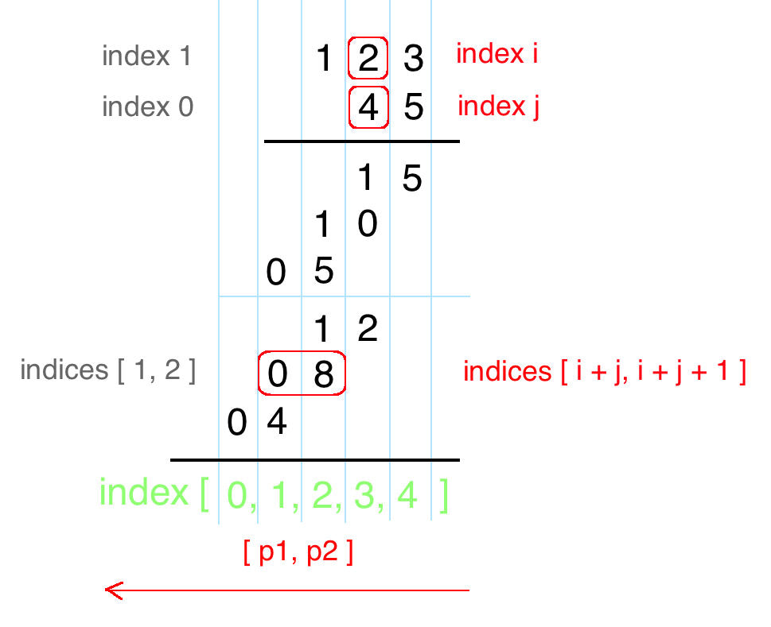

# [43. Multiply Strings](https://leetcode.com/problems/multiply-strings/description/)

## Description

Given two non-negative integers `num1` and `num2` represented as strings, return the product of `num1` and `num2`.

**Note:**

1. The length of both `num1` and `num2` is < 110.
2. Both `num1` and `num2` contains only digits 0-9.
3. Both `num1` and `num2` does not contain any leading zero.
4. You **must not use any built-in BigInteger library** or **convert the inputs to integer** directly.

## Solution

Start from right to left, perform multiplication on every pair of digits, and add them together. Let's draw the process! From the following draft, we can immediately conclude:

 `num1[i] * num2[j]` will be placed at indices `[i + j`, `i + j + 1]`

