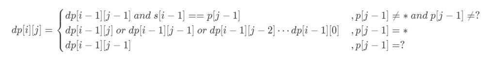
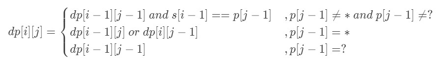

# [44. Wildcard Matching](https://leetcode.com/problems/wildcard-matching/)

## Description

Given an input string (`s`) and a pattern (`p`), implement wildcard pattern matching with support for `'?'` and `'*'`.

```
'?' Matches any single character.
'*' Matches any sequence of characters (including the empty sequence).
The matching should cover the entire input string (not partial).
```

The matching should cover the **entire** input string (not partial).

**Note:**

* `s` could be empty and contains only lowercase letters `a-z`.
* `p` could be empty and contains only lowercase letters `a-z`, and characters like `?` or `*`.


**Example 1:**    

```
Input:
s = "aa"
p = "a"
Output: false
Explanation: "a" does not match the entire string "aa".
```

**Example 2:**    

```
Input:
s = "aa"
p = "*"
Output: true
Explanation: '*' matches any sequence.
```

**Example 3:**   

```
Input:
s = "cb"
p = "?a"
Output: false
Explanation: '?' matches 'c', but the second letter is 'a', which does not match 'b'.
```

**Example 4:**    

```
Input:
s = "adceb"
p = "*a*b"
Output: true
Explanation: The first '*' matches the empty sequence, while the second '*' matches the substring "dce".
```

**Example 4:**    

```
Input:
s = "acdcb"
p = "a*c?b"
Output: false
```

## Solution

* dp O(n*m) time

观察问题，原问题可以看做是s的n个字符和p的m个字符是否匹配，那么很容易reduce成子问题：s的前i个字符和p的前j个字符是否匹配，记作$dp[i][j]$，那么有递归表达式：



note: p[j-1]代表的是第j个字符
其中当p[j-1]='*'时：

* '*'匹配0个字符，dp[i][j]=dp[i-1][j]
* '*'匹配1个字符，dp[i][j]=dp[i-1][j-1]
* '*'匹配1个字符，dp[i][j]=dp[i-1][j-2]
* ……
由于当p[j-1]='*'时：dp[i][j-1]=dp[i-1][j-1] || dp[i-1][j-2] || dp[i-1][j-3] || …… || dp[i-1][0]
所以上述递归表达式时可以简化为：



初始状态：

dp[0][0]=0
若p[0]='*'，需单独讨论

```c++
class Solution
{
public:
    bool isMatch(string s, string p)
    {
        if (p.empty())
            return s.empty();
        if (s.empty())
            return p.empty() || p.find_first_not_of('*') == string::npos;
        int m = s.size(), n = p.size();
        vector<vector<int>> dp(m + 1, vector<int>(n + 1, false));
        dp[0][0] = true;
        if (p[0] == '*')
        {
            for (int i = 1; i <= m; ++i)
                dp[i][0] = true;
            for (int j = 1; j <= n; ++j)
                dp[0][j] = dp[0][j - 1] && p[j - 1] == '*';
        }
        for (int i = 1; i <= m; ++i)
        {
            for (int j = 1; j <= n; ++j)
            {
                if (p[j - 1] != '*')
                    dp[i][j] = dp[i - 1][j - 1] && (p[j - 1] == '?' || s[i - 1] == p[j - 1]);
                else
                {
                    dp[i][j] = dp[i - 1][j] || dp[i][j - 1];
                }
            }
        }
        return dp[m][n];
    }
};
```
