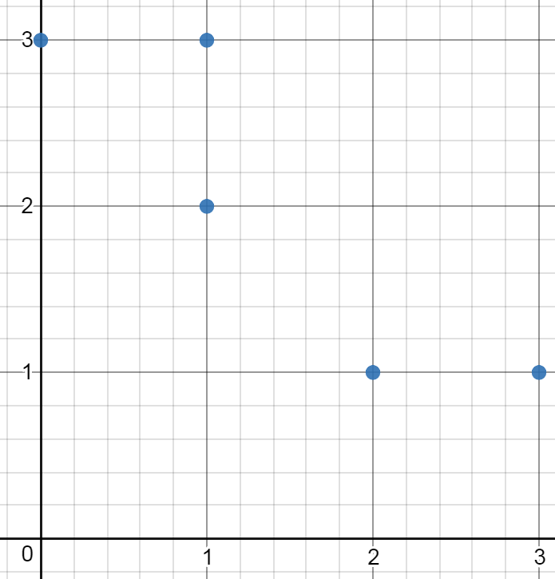
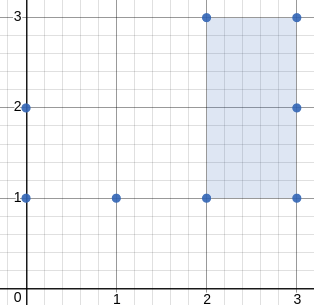

# [963. Minimum Area Rectangle II](https://leetcode.com/problems/valid-triangle-number/description/)

## Description

Given a set of points in the xy-plane, determine the minimum area of **any** rectangle formed from these points, with sides **not necessarily parallel** to the x and y axes.

If there isn't any rectangle, return 0.

**Example 1:**  


```
Input: [[1,2],[2,1],[1,0],[0,1]]
Output: 2.00000
Explanation: The minimum area rectangle occurs at [1,2],[2,1],[1,0],[0,1], with an area of 2.
```


**Example 2:**  

```
Input: [[0,1],[2,1],[1,1],[1,0],[2,0]]
Output: 1.00000
Explanation: The minimum area rectangle occurs at [1,0],[1,1],[2,1],[2,0], with an area of 1.
```   



**Example 3:**  

```
Input: [[0,3],[1,2],[3,1],[1,3],[2,1]]
Output: 0
Explanation: There is no possible rectangle to form from these points.
```   



**Example 4:**  

```
Input: [[3,1],[1,1],[0,1],[2,1],[3,3],[3,2],[0,2],[2,3]]
Output: 2.00000
Explanation: The minimum area rectangle occurs at [2,1],[2,3],[3,3],[3,1], with an area of 2.
```   

**Note:**
1. `1 <= points.length <= 50`
2. `0 <= points[i][0] <= 40000`
3. `0 <= points[i][1] <= 40000`
4. All points are distinct.
5. Answers within `10^-5` of the actual value will be accepted as correct.


## Solution

* Approach 1: Iterate Triangles

Intuition

For each triangle, let's try to find the 4th point and whether it is a rectangle.

Algorithm

Say the first 3 points are p1, p2, p3, and that p2 and p3 are opposite corners of the final rectangle. The 4th point must be p4 = p2 + p3 - p1 (using vector notation) because p1, p2, p4, p3 must form a parallelogram, and p1 + (p2 - p1) + (p3 - p1) = p4.

If this point exists in our collection (we can use a HashSet to check), then we should check that the angles of this parallelogram are 90 degrees. The easiest way is to check the dot product of the two vectors (p2 - p1) and (p3 - p1). (Another way is we could normalize the vectors to length 1, and check that one equals the other rotated by 90 degrees.)
